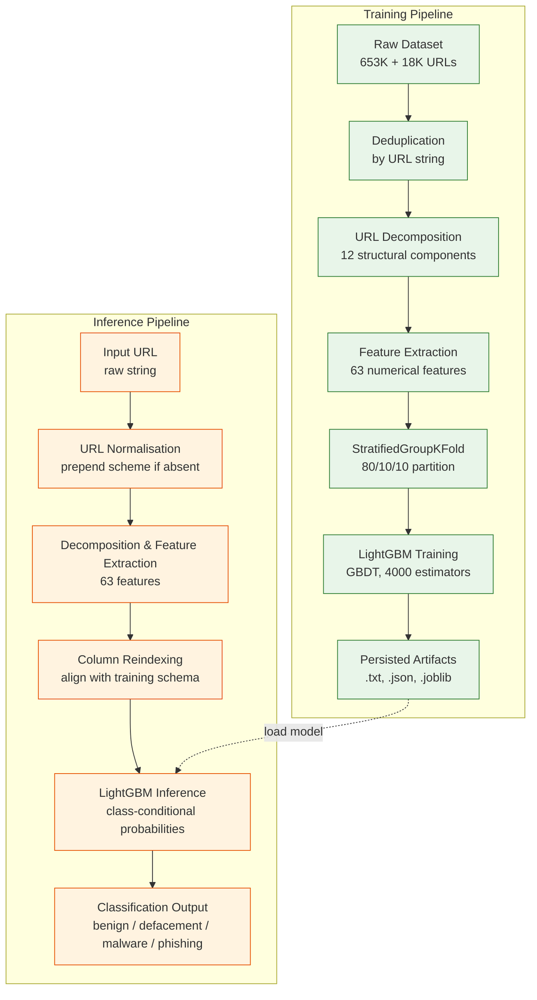

# 🔍 Multi-class Malicious URL Classification via Static Lexical Analysis

A malicious URL classification system using **Static Lexical Analysis** combined with **LightGBM Gradient Boosted Decision Trees (GBDT)**. The system classifies URLs into **4 categories**: `benign`, `phishing`, `malware`, and `defacement` — entirely based on the URL string structure **without accessing the web page content**, achieving an **accuracy of 93.46%** on the test set with **zero domain overlap**.

> **Key Feature:** The entire inference process operates purely on the URL string with **sub-millisecond latency**, making it highly suitable for real-time integration into network security appliances and browser extensions.

---

## 📊 Model Overview

| Parameter | Value |
|---|---|
| **Algorithm** | LightGBM (GBDT) |
| **Classes** | 4 (`benign`, `defacement`, `malware`, `phishing`) |
| **Test Accuracy** | **93.46%** |
| **Number of Features** | 63 features (6 groups) |
| **Total Data** | 661,976 unique samples |
| **Training Set** | 529,580 samples |
| **Validation Set** | 66,198 samples |
| **Test Set** | 66,198 samples |
| **Best iteration** | 738 / 4,000 (early stopping) |
| **Data Partitioning** | StratifiedGroupKFold (80/10/10) — zero domain leakage |

---

## 📁 Project Structure

```
MultiLabelClassification/
│
├── src/                            # Source code
│   ├── __init__.py
│   ├── features/                   # Feature extraction module
│   │   ├── __init__.py
│   │   └── feature_extraction.py   # Extracts 63 features from URL
│   ├── FIlter/                     # URL preprocessing module
│   │   └── Normalize_url.py        # Normalizes input URL
│   └── Optimizer/                  # Custom loss function optimization (in development)
│       ├── loss.h                  # Header file for custom loss
│       └── loss.c                  # Implementation of custom loss (C)
│
├── notebooks/                      # Jupyter Notebooks & model artifacts
│   ├── data_exploration.ipynb      # Data exploration & analysis
│   ├── test.ipynb                  # Testing notebook
│   ├── test_model.ipynb            # Model evaluation & testing
│   ├── lgb_url_classifier.txt      # LightGBM Model (Booster native format)
│   └── label_encoder.joblib        # Label encoder for 4 classes
│
├── test/                           # Testing scripts
│   ├── take url and return result.py  # Main script: input URL → predict result
│   └── test1_array.py              # Script to test metadata
│
├── report/                         # Technical report
│   └── MLreport.tex                # Comprehensive LaTeX report
│
├── requirements.txt                # Required Python libraries
├── setup.py                        # Python package configuration
├── .gitignore                      # Git ignore rules
└── README.md                       # This file
```

---

## 📂 Data Sources

### 1. Kaggle Malicious Phish Corpus (Primary)
- **653,490** labeled URL samples, covering 4 classes: `benign`, `defacement`, `malware`, `phishing`
- The data exhibits moderate class imbalance, with `benign` being the majority.

### 2. URLhaus Malware Feed (Supplementary)
- **18,696** additional URLs from [URLhaus](https://urlhaus.abuse.ch/) — a threat intelligence feed by abuse.ch
- Only adds URLs that do not exist in the primary dataset, labeling them as `malware`.

### 3. Trusted Domain Whitelist
- **10,001** curated reputable domains, used for calculating Levenshtein similarity.
- Includes globally prominent domains (Google, Facebook, Microsoft...), Vietnamese domains (Vietcombank, VnExpress...), government, and international organizations.

> **Summary:** After aggregation and deduplication by URL string → **661,976 unique samples**.

---

## 🔄 Processing Pipeline



### URL Normalisation
- **Training-time:** If the URL lacks a scheme, prepends `//` to allow `urlparse` to correctly identify the netloc.
- **Inference-time:** If the URL lacks a scheme and does not contain `/`, prepends `https://`.

### Core Inference Logic

```python
def predict_url(url, booster, le, feature_columns, whitelist):
    # 1. Feature extraction and vectorization
    X_row = url_to_feature_row(url, feature_columns, whitelist)
    
    # 2. LightGBM inference
    proba = booster.predict(X_row)[0]
    
    # 3. Label mapping
    labels = le if isinstance(le, np.ndarray) else le.classes_
    result = {label: round(float(p) * 100, 2) for label, p in zip(labels, proba)}
    
    return result
```

---

## 🧠 Feature Engineering — 63 Features

The system extracts **63 numerical features** from each URL, grouped into **6 categories**:

### Group 1: Structural & Presence Features (14 features)
Checks the existence of individual URL components:
- `url_length`, `number_of_part`, `has_scheme`, `has_netloc`, `has_path`, `has_params`, `has_query`, `has_fragment`
- `has_username`, `has_password` — detects credential embedding (a phishing vector)
- `has_port`, `has_subdomain`, `has_domain`, `has_suffix`

### Group 2: Length Features (6 features)
Measures the character length of each component:
- `netloc_length`, `path_length`, `query_length`, `fragment_length`, `subdomain_length`, `domain_length`

### Group 3: Statistical & Entropy Features (6 features)
Uses **Shannon Entropy** to measure randomness — automatically generated domains (DGAs) tend to have anomalously high entropy:

$$H(s) = \log_2(n) - \frac{1}{n}\sum_{i=1}^{k} c_i \cdot \log_2(c_i)$$

- `url_entropy`, `netloc_entropy`, `path_entropy`, `query_entropy`, `subdomain_entropy`, `domain_entropy`

### Group 4: Special Character Features (11 features)
Counts special characters within each component:
- `hyphen_in_subdomain`, `hyphen_in_domain` — phishing domains frequently use hyphens.
- `unicode`, `punycode` — detects IDN homograph attacks.
- `at_sign_in_netloc` — detects URL spoofing (`http://trusted.com@evil.com`).
- `slash_in_path`, `dot_in_path`, `strange_in_query`, `equal_in_query`, `ampersand_in_query`
- `number_subdomain` — the number of subdomain levels.

### Group 5: Lexical & Heuristic Features (16 features)
The most analytical group, using string-similarity algorithms and domain knowledge:
- **Normalized Levenshtein Distance** (`normalized_levenshtein_domain`, `normalized_levenshtein_subdomain`) — compared against a 10,001 domain whitelist to detect typosquatting.
- **Consonant ratio** (`random_domain_check`, `random_subdomain_check`) — identifies Algorithmically Generated Domains (AGDs).
- **Digit ratio** (`number_ratio_domain`, `number_ratio_subdomain`)
- **Repeated character ratio** (`repeated_domain_check`, `repeated_path_check`, `repeated_url_check`, `longest_repeated_chain`)
- `ip_domain` — checks if the domain is an IP address.
- **Suspicious keywords** (`suspicious_key_domain`, `suspicious_key_subdomain`, `suspicious_key_path`, `suspicious_key_query`) — detects suspicious words: `login`, `verify`, `banking`, `password`, `secure`, `account`, `update`, `confirm`, etc.
- `shortened` — detects shortened URLs (`bit.ly`, `tinyurl.com`...)

### Group 6: Scheme & Additional Features (10 features)
- **Scheme one-hot encoding:** `is_https`, `is_http`, `is_ftp`, `is_none`, `is_other`
- UUID detection, download parameters, free hosting detection, suspicious TLDs.

---

## ⚙️ Model Architecture

### LightGBM GBDT
Uses the **Gradient Boosted Decision Trees** algorithm with optimization techniques:
- **GOSS** (Gradient-based One-Side Sampling) — retains samples with large gradients while sampling those with small gradients.
- **EFB** (Exclusive Feature Bundling) — bundles mutually exclusive features to reduce dimensionality.

### Loss Function: Softmax Cross-Entropy

$$\mathcal{L} = -\frac{1}{N}\sum_{i=1}^{N}\sum_{c=1}^{C} y_{i,c} \cdot \log(p_{i,c})$$

with class-conditional probabilities obtained via the softmax function:

$$p_{i,c} = \frac{\exp(z_{i,c})}{\sum_{j=1}^{C} \exp(z_{i,j})}$$

### Class Balancing
Uses `class_weight='balanced'` — automatically adjusts weights according to class frequencies:

$$w_c = \frac{N}{C \cdot N_c}$$

### Regularization Strategy (Anti-Overfitting) — 6 Layers
1. **Structural constraints:** `max_depth=5`, `num_leaves=24`
2. **Minimum leaf population:** `min_data_in_leaf=50`
3. **Feature subsampling:** `colsample_bytree=0.75`
4. **Row subsampling:** `subsample=0.80`
5. **L1/L2 regularization:** `reg_alpha=0.1`, `reg_lambda=1.0`
6. **Minimum split gain:** `min_gain_to_split=0.01`

---

## 🛠️ Hyperparameters

```json
{
  "objective": "multiclass",
  "num_class": 4,
  "boosting_type": "gbdt",
  "class_weight": "balanced",
  "n_estimators": 4000,
  "learning_rate": 0.025,
  "max_depth": 5,
  "num_leaves": 24,
  "min_data_in_leaf": 50,
  "colsample_bytree": 0.75,
  "subsample": 0.80,
  "subsample_freq": 1,
  "reg_alpha": 0.1,
  "reg_lambda": 1.0,
  "min_gain_to_split": 0.01,
  "early_stopping_rounds": 100
}
```

---

## ⚙️ Installation

### System Requirements
- Python 3.8+
- Windows / Linux / macOS

### Install Dependencies

```bash
pip install -r requirements.txt
```

| Library | Purpose |
|---|---|
| `pandas` | Tabular data processing |
| `numpy` | Numerical computations |
| `scikit-learn` | Label encoding, StratifiedGroupKFold, metrics |
| `lightgbm` | Main classification model (GBDT) |
| `tldextract` | Accurate domain parsing (eTLD-aware) |
| `rapidfuzz` | Levenshtein distance computation (typosquatting detection) |
| `matplotlib` | Data visualization |
| `jupyter` | Running analysis notebooks |

### Install Source Package

```bash
pip install -e .
```

---

## 🚀 Usage

### Predict URL from Command Line

```bash
python "test/take url and return result.py" "https://example.com"
```

Or run in interactive mode:

```bash
python "test/take url and return result.py"
```

### Example Output

```
URL: https://87khq5gx.ravabetensani.site/?ublib=ca0a10e1-15b1-489c-a27f-7703d460170c

----------------------------------------
  malware         :  98.07%
  phishing        :   1.91%
  benign          :   0.01%
  defacement      :   0.00%
----------------------------------------
=> Prediction: 'malware' (98.07%)
```

---

## 📊 Evaluation Results

- **Test Accuracy:** 93.46% on 66,198 samples (zero domain overlap with the training set).
- **Evaluation Metrics:** Per-class Precision, Recall, F1-score.
- **Visual Diagnostics:** Confusion matrix, train/validation learning curves (multi_logloss).
- **Model Interpretability:** Feature importance (information gain) + SHAP analysis.
- **Early Stopping:** Triggered at iteration 738/4,000 — model converged at 18.5% of its capacity budget.

---

## 🚧 Limitations & Future Work

1. **Hyperparameter optimization** — Systematic tuning via Bayesian optimization (Optuna) or random search.
2. **Ensemble methods** — Combining LightGBM with complementary classifiers like XGBoost or Random Forest through weighted averaging or stacking.
3. **Feature augmentation** — Incorporating WHOIS registration age, SSL certificates, and passive DNS metadata.
4. **Dynamic thresholding** — Adapting the classification boundary based on contextual signals (geographic origin, time of day, etc.).
5. **Deployment** — Integration into a REST API or browser extension for real-time URL screening.

---

## 📌 Notes

- The `Optimizer/` module (custom C loss function) is under development.
- Data files (`.csv`, `.pkl`, `.json`) are ignored by `.gitignore` — they need to be acquired separately.
- The model is saved as a `.txt` (native Booster format) in `notebooks/`.
- Data splitting utilizes **StratifiedGroupKFold** to guarantee zero domain leakage between train/val/test splits.
