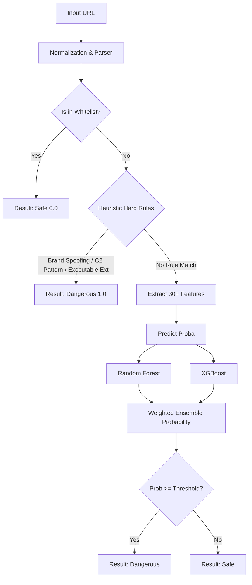

# 🛡️ PhishShield: URL Phishing & Malware Detection System

[](https://www.python.org/)
[](https://flask.palletsprojects.com/)
[](https://scikit-learn.org/)
[](https://xgboost.readthedocs.io/)
[](https://opensource.org/licenses/MIT)

A hybrid **Heuristic Rule Engine + Machine Learning (Ensemble)** solution designed to detect malicious, phishing, and malware-distribution URLs. The system features advanced feature extraction, heuristic validation (brand spoofing, C2 pattern detection), and a weighted prediction model (Random Forest & XGBoost) optimized using $F_2$-score metric to prioritize recall (minimizing false negatives).

---

## 🌟 Key Features

- **⚡ Multi-Stage Detection Pipeline**: Uses a fast whitelist filter, then applies high-priority hard heuristics, and finally falls back to ML model predictions if no clear rule matches.
- **📊 Advanced Feature Engineering**: Extracts over 30+ lexical, structural, entropy, and brand-relationship features from any given URL.
- **🧠 Weight-Optimized ML Ensemble**: Leverages an ensemble of **Random Forest** and **XGBoost** models. During training, weights are dynamically adjusted using grid search to maximize the $F_2$ score.
- **🔍 Intelligent Hard Rules & Dynamic Thresholds**:
  - **Brand Spoofing**: Computes substring similarity using `rapidfuzz` (averaging full ratio and partial ratio) against top global/local brands, with length-ratio safeguards to prevent false positives (e.g., `vietnamnet` vs `vinaphone`).
  - **C2 Malware Callbacks**: Detects randomized subdomains (via Shannon Entropy) combined with UUID patterns in paths.
  - **Malware Distribution**: Identifies executable downloads hosted on free VPS/hosting sites.
  - **Vietnam TLDs (`.vn`)**: Applies specialized, highly-permissive thresholds to VNNIC-registered domains (`.vn`, `.com.vn`, etc.) which are strictly regulated and rarely abused.
- **📝 Dynamic Domain Whitelisting**: Employs a local cache generated from the Tranco Top-1M domains to skip evaluation of highly trusted websites.
- **🖥️ Dual Interface**: Includes a responsive **Flask Web App** UI (in English) and a **Command Line Interface (CLI)**.

---

## 📐 Pipeline Architecture



---

## 📁 Project Structure

```text
MLProject/
├── data/
│   ├── malicious_phish.csv  # Training dataset (phishing/safe URLs)
│   ├── top-1m.csv           # Tranco Top 1M domains list
│   └── whitelist.txt        # Auto-generated whitelist
├── models/
│   ├── rf_model.pkl         # Trained Random Forest Model (Git ignored)
│   ├── xgb_model.json       # Trained XGBoost Model
│   └── weights.json         # Optimal ensemble weights (w_rf, w_xgb)
├── src/
│   ├── __init__.py
│   ├── feature.py           # Feature extraction, whitelisting & brand heuristics
│   ├── predict.py           # Multi-stage evaluation & prediction logic
│   └── training.py          # Model training, validation, and grid-search weights
├── static/
│   └── style.css            # Custom premium CSS styling for Web UI
├── templates/
│   └── index.html           # Web UI interface page
├── app.py                   # Flask server application
├── main.py                  # Vietnamese CLI application
└── .gitignore               # Ignored environments, model binaries, cache, & IDE junk
```

---

## 🛠️ Installation & Setup

### 1. Clone & Navigate
```bash
git clone https://github.com/trungdo2711/MLProject.git
cd MLProject
```

### 2. Configure Virtual Environment & Install Dependencies
It is highly recommended to use a virtual environment:
```bash
# Create environment
python -m venv venv

# Activate on Windows
venv\Scripts\activate
# Activate on macOS/Linux
source venv/bin/activate

# Install required packages
pip install flask pandas numpy xgboost scikit-learn joblib rapidfuzz tldextract
```

### 3. Setup Dataset & Whitelist
Place your datasets in the `data/` directory. To generate the whitelist from the Tranco top 1M list:
```bash
python src/feature.py
```

---

## 🚀 Usage Guide

### 1. Web UI Dashboard (Flask)
Start the web application locally:
```bash
python app.py
```
Open [http://127.0.0.1:5000/](http://127.0.0.1:5000/) in your browser. Enter any URL to get instant analysis, classification results, models' vote probabilities, and rule reasoning.

### 2. Command Line Interface (CLI)
Run the interactive Vietnamese CLI scanner:
```bash
python main.py
```
**Example usage:**
```text
=================================================================
       HỆ THỐNG AI PHÁT HIỆN URL LỪA ĐẢO (PHISHING)       
=================================================================

👉 Nhập URL cần kiểm tra (hoặc gõ 'exit' để thoát): secure-paypal-verify.tk
⏳ Đang quét đặc trưng và phân tích...
-----------------------------------------------------------------
👉 Phán quyết cuối cùng : [ 🚨 LỪA ĐẢO (DANGEROUS) ]
📊 Độ tự tin (Xác suất) : 100.00%
🧠 Nguồn phán quyết     : hard_rule
📝 Lý do                : Suspicious TLD + brand similarity: 0.85
-----------------------------------------------------------------
```

### 3. Model Retraining Pipeline
To retrain the ML classifiers and re-calculate the ensemble weights based on `data/malicious_phish.csv`:
```bash
python src/training.py
```
This script will output the training process logs, print the classification report for both individual models and the ensemble, and automatically save the model binaries to the `models/` directory.

---

## 📊 Extracted Features Breakdown

The system extracts **33 features** split into 4 primary categories:

| Feature Name | Category | Description |
| :--- | :--- | :--- |
| `url_len`, `domain_len`, `path_len` | Lexical / Size | Length of URL, domain, and path parts. |
| `count_dot`, `count_hyphen`, `count_slash`, etc. | Structural | Occurrence of special characters in the URL structure. |
| `shannon_entropy` | Entropy | Measures random-like character distribution in the hostname. |
| `digit_ratio`, `letter_ratio` | Lexical | Ratio of digits and letters in the clean URL string. |
| `tld_suspicious` | Top-Level Domain | Detects if TLD belongs to the high-risk pool (`.tk`, `.xyz`, etc.). |
| `brand_similarity` | Lexical Brand Match | Similarity score of the domain to 20+ top global and local brands. |
| `subdomain_is_random` | Subdomain Heuristic | Detects if the subdomain part matches high-entropy/random generation. |
| `is_free_hosting` | Host Heuristic | Detects hosting on platforms often abused by malicious actors. |
| `has_executable_ext` | Payload Heuristic | Identifies typical malware extensions (e.g. `.exe`, `.msi`, `.sh`, `.bin`). |
| `is_domain_only` | Structural | Flags bare domains (no path/query) to allow the ML model to self-correct its bias against short URLs. |
